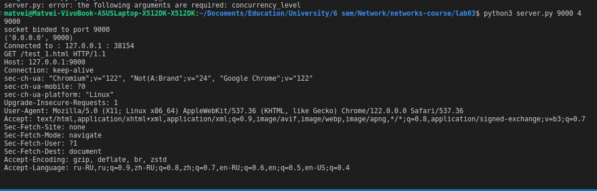
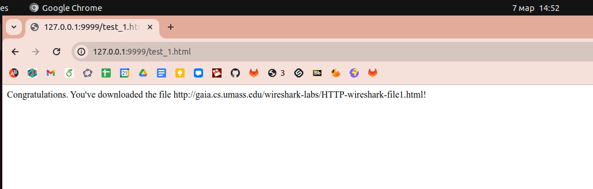
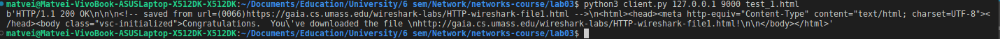

# Практика 3. Прикладной уровень

## Программирование сокетов. Веб-сервер

Написал на python программу для симуляции серверной части с возможностью в несколько (заранее ограниченное число потоков) выдавать имеющиеся страницы с симуляцией поиска (в случае неудачи - засыпаем на 10 секунд). Также установил максимальное количество ответов, после которого сервер будет выключаться

Написал на python программу для симуляции клиентской части с возможностью через терминал запрашивать данные с сервера

Для запуска необходимо проинтерпретировать питоном соответствующий файл с аргументами, как требует формат задания (для сервера - номер порта и кол-во потоков, для клиента - имя хоста, порта и имя файла)

Затем написал решения задач и прикрепил мем. Берите чаёк, печеньки и наслаждайтесь!

### А. Однопоточный веб-сервер (3 балла)
Вам необходимо разработать простой веб-сервер, который будет возвращать содержимое
локальных файлов по их имени. В этом задании сервер умеет обрабатывать только один запрос и
работает в однопоточном режиме. Язык программирования вы можете выбрать любой.
Требования:
- веб-сервер создает сокет соединения при контакте с клиентом (браузером) получает HTTP-запрос из этого соединения
- анализирует запрос, чтобы определить конкретный запрашиваемый файл
- находит запрошенный файл в своей локальной файловой системе
- создает ответное HTTP-сообщение, состоящее из содержимого запрошенного файла и предшествующих ему строк заголовков
- отправляет ответ через TCP-соединение обратно клиенту
- если браузер запрашивает файл, которого нет на веб-сервере, то сервер должен вернуть сообщение об ошибке «404 Not Found»

Ваша задача – разработать и запустить свой локальный веб-сервер, а затем проверить его
работу при помощи отправки запросов через браузер. Продемонстрируйте работу сервера, приложив скрины.

Скорее всего порт 80 у вас уже занят, поэтому вам необходимо использовать другой порт для
работы вашей программы.

Формат команды для запуска сервера:
```
<server.exe> server_port
```

#### Демонстрация работы

Положил html страничку с первой практики в файл test_1.html, подгрузил её:


(на первом скрине - запуск и дамп в терминал запросы, на втором - ответная страница)

 

 

Запускаемся на порту 

### Б. Многопоточный веб-сервер (2 балла)
Реализуйте многопоточный сервер, который мог бы обслуживать несколько запросов
одновременно. Сначала создайте основной поток (процесс), в котором ваш модифицированный
сервер ожидает клиентов на определенном фиксированном порту. При получении запроса на
TCP-соединение от клиента он будет устанавливать это соединение через другой порт и
обслуживать запрос клиента в отдельном потоке. Таким образом, для каждой пары запрос-ответ
будет создаваться отдельное TCP-соединение в отдельном потоке.

#### Демонстрация работы

Для демонстрации отправлю несколько ложных запросов, треды с ними должны будут уснуть - браузер будет ожидать ответа, в то время, как последний получит ответ:

(можно видеть, что первые страницы грузятся, в низ запрошен некорректный файл, а в третьей уже получили ответ. Как показать, что это не жульничество, и что я реально в таком порядке запрашивал - не придумал. Так что вам или верить, или проверить)

 

### В. Клиент (2 балла)
Вместо использования браузера напишите собственный HTTP-клиент для тестирования вашего
веб-сервера. Ваш клиент будет поддерживать работу с командной строкой, подключаться к
серверу с помощью TCP-соединения, отправлять ему HTTP-запрос с помощью метода GET и
отображать ответ сервера в качестве результата. Клиент должен будет в качестве входных
параметров принимать аргументы командной строки, определяющие IP-адрес или имя сервера,
порт сервера и имя файла на сервере. Продемонстрируйте работу клиента, приложив скрины. 

Формат команды для запуска клиента:
```
<client.exe> server_host server_port filename
```

#### Демонстрация работы

Запустил в терминале с необходимыми аргументами - получил в ответ страничку html

 


### Г. Ограничение потоков сервера (3 балла)
Пусть ресурсы вашего сервера ограничены и вы хотите контролировать максимальное количество
потоков, с которыми может работать ваш многопоточный сервер одновременно. При запуске
сервер получает целочисленное значение `concurrency_level` из командной строки. Если сервер 
получает запрос от клиента, и при этом уже запущено максимальное количество потоков, то 
запрос от клиента блокируется (встает в очередь) и дожидается, пока не закончит работу 
один из запущенных потоков. После этого сервер может запустить новый поток для обработки 
запроса от клиента.

Формат команды для запуска сервера:
```
<server.exe> server_port concurrency_level
```
#### Демонстрация работы

Запросим несколько ложных страниц и увидим, что пятая корректная страница стала в очередь ожидания:

 

 (да, я проверял, как усыплять треды. Ещё некоторое наблюдение - если посылать одинаковые запросы, то он как-то очень странно их обрабатывает - не накапливается 4 спящих, и я вот так пытался прогуглить, что же там не так. Помогло запрашивать разные файлы - так занял 4 процесса и все уснули)

## Задачи

### Задача 1 (2 балла)
Голосовые сообщения отправляются от хоста А к хосту Б в сети с коммутацией пакетов в режиме реального времени. Хост А преобразует на лету аналоговый голосовой сигнал в цифровой поток битов, имеющий скорость $128$ Кбит/с, и разбивает его на $56$-байтные пакеты. Хосты А и Б соединены одной линией связи, в которой скорость передачи данных равна $1$ Мбит/с, а задержка распространения составляет $5$ мс. Как только хост А собирает пакет, он посылает его на хост Б, который, в свою очередь, при получении всего пакета преобразует биты в аналоговый сигнал. Сколько времени проходит с момента создания бита (из исходного аналогового сигнала на хосте A) до момента его декодирования (превращения в часть аналогового сигнала на хосте Б)?

#### Решение

Ответ $12.448ms$

Общая задержка складывается из времени передачи, задержки распространения и времени на преобразование в/обратно аналоговый сигнал

Тогда общее время будет 

$$
\frac{56 \times 8b}{128Kb} + 
\frac{56 \times 8b}{1 \times 1000 Kb} + 
\frac{56 \times 8b}{128Kb} + 
5 ms = 
3.5ms + 0.448ms + 3.5ms + 5ms = 12.448ms
$$


### Задача 2 (2 балла)
Рассмотрим буфер маршрутизатора, где пакеты хранятся перед передачей их в исходящую линию связи. В этой задаче вы будете использовать широко известную из теории массового
обслуживания (или теории очередей) формулу Литтла. Пусть $N$ равно среднему числу пакетов в буфере плюс пакет, который передается в данный момент. Обозначим через $a$ скорость поступления пакетов в буфер, а через $d$ – среднюю общую задержку (т.е. сумму задержек ожидания и передачи), испытываемую пакетом. Согласно формуле Литтла $N = a \cdot d$. Предположим, что в буфере содержится в среднем $10$ пакетов, а средняя задержка ожидания для пакета равна $10$ мс. Скорость передачи по линии связи составляет $100$ пакетов в секунду. Используя формулу Литтла, определите среднюю скорость поступления пакета в очередь, предполагая, что потери пакетов отсутствуют.

#### Решение

Ответ: $0.55$ пакета за миллисекунду 

Из формулировки задания следует, что $N = 10 + 1, d = 10 ms$, Тогда заметим, что $a = \frac{N}{d} = \frac{11}{0.010 + \frac{1}{100}} = 0.00(45)$. Откуда средняя скорость поступления $0,000(45)$

(Кажется, что ответ был бы сильно лучше, если бы в буфере было б в среднем 9 пакетов, тогда бы $N = 9 + 1$. Или $N$ определялось бы как количество пакетов в буфере, не читая того, кто передаётся)

### Задача 3 (2 балла)
Рассмотрим рисунок.


Предположим, нам известно, что на маршруте от сервера до клиента узким местом является первая линия связи, скорость передачи данных по которой равна $R_S$ бит/с. Допустим, что мы отправляем два пакета друг за другом от сервера клиенту, и другой трафик на маршруте отсутствует. Размер каждого пакета составляет $L$ бит, а скорость распространения сигнала по обеим линиям равна $d_{\text{распространения}}$. 

1. Какова временная разница прибытия пакетов к месту назначения? То есть, сколько времени пройдет от момента получения клиентом последнего бита первого пакета до момента получения последнего бита второго пакета? 

2. Теперь предположим, что узким местом является вторая линия связи (то есть $R_C < R_S$). Может ли второй пакет находиться во входном буфере, ожидая передачи во вторую линию? Почему? Если предположить, что сервер отправляет второй пакет, спустя $T$ секунд после отправки первого, то каково должно быть минимальное значение $T$, чтобы очередь во вторую линию связи была нулевая? Обоснуйте ответ.

#### Решение

1. Заметим, что с тех пор, как очередной пакет поступит на маршрутизатор он начнёт мгновенно передаваться дальше. Тогда между последними битами ровно столько, сколько будет передаваться первый пакет по первому каналу - это ровно $\frac{L}{R_S}$

2. Заметим, что разница во времени между приходом на маршрутизатор последнего бита второго пакета и последнего бита первого пакета - в точности время передачи пакета по первой линии. Оно меньше, чем необходимо времени пакету для передачи по второй линии - а значит он постоит в очереди, прежде, чем начнёт передаваться

Чтоб ему не пришлось ждать - нужно, чтоб прошло столько времени, сколько передаётся пакет по второй линии минус сколько по первой = $\frac{L}{R_C} - \frac{L}{R_S} = \frac{L(R_S - R_C)}{R_S R_C}$


### Задача 4 (4 балла)


На рисунке показана сеть организации, подключенная к Интернету: 
Предположим, что средний размер объекта равен $850 000$ бит, а средняя скорость запросов от браузеров этой организации к веб-серверам составляет $16$ запросов в секунду. Предположим также, что количество времени, прошедшее с момента, когда внешний маршрутизатор организации пересылает запрос HTTP, до момента, пока он не получит ответ, равно в среднем три секунды. Будем считать, что общее среднее время ответа равно сумме средней задержки доступа (то есть, задержки от маршрутизатора в Интернете до маршрутизатора организации) и средней задержки в Интернете. Для средней задержки доступа используем формулу $\dfrac{\Delta}{1 - \Delta \cdot B}$, где $\Delta$ – это среднее время, необходимое для отправки объекта по каналу связи, а B – частота поступления объектов в линию связи. 

1. Найдите $\Delta$ (это среднее время, необходимое для отправки объекта по каналу связи).

2. Найдите общее среднее время ответа.

3. Предположим, что в локальной сети организации присутствует кэширующий
сервер. Пусть коэффициент непопадания в кэш равен $0.4$. Найдите общее время ответа.

#### Решение

1. Заметим, что $\delta = \frac{L}{R_1} + \frac{L}{R_2} = \frac{850 000}{100Mb} + \frac{850 000}{15 Mb} = 0,0651(6)s$

2. Общее среднее время ответа, как нас заверили есть сумма среднего времени ответа и задержки в интернете. $B = 16$, подставим всё в формулу:

$$
\frac{\delta}{1 - \delta \cdot B} + 3s =
\frac{0,0651(6)}{1 - 0,0651(6) \cdot 16} + 3s =
2,89629694s + 3s = 
5,89629694s
$$

Т.е. примерно $6s$ - общая средняя задержка. Терпимо, если нужно раз в день скачать книжку а потом сидеть и изучать компьютерные сети. Но всегда хочется всё побыстрее

3. Заметим, что если мы попали в кеш, то необходимое время буде: $\frac{L}{R} = \frac{850 000}{100Mb} = 0,0085s$, а иначе - $5.9s$ (округлю для всеобщего удобства). Тогда среднее время будет - $0,0085 × 0,4 + 5.9 × 0,6 = 3,5434$, что на $40$% быстрее! (ещё чуть-чуть и обгоним время ответа из интернета на последний маршрутизатор!!!)


### Какая ж работа, без хорошего мема!


