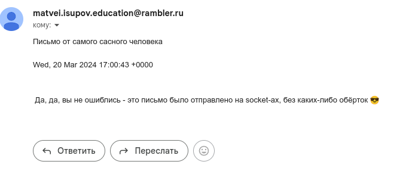
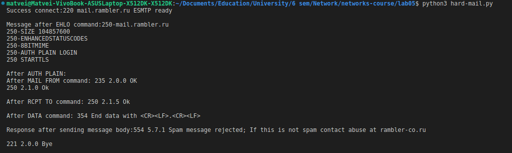
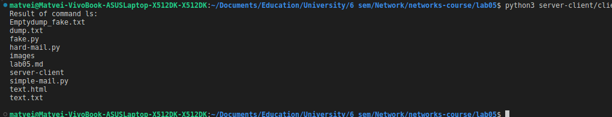
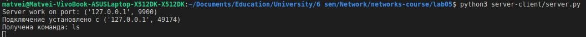
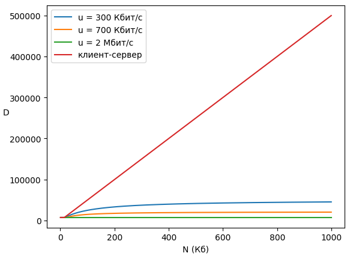
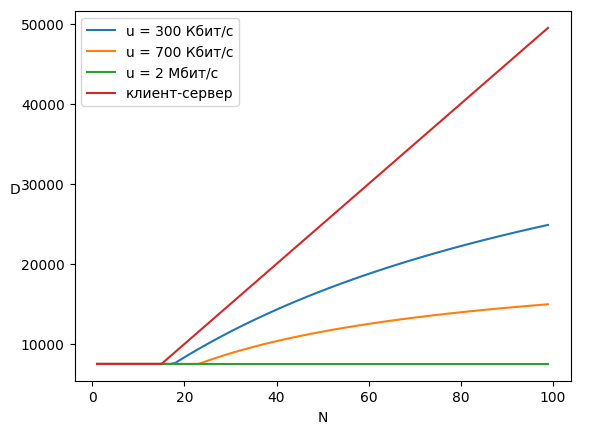
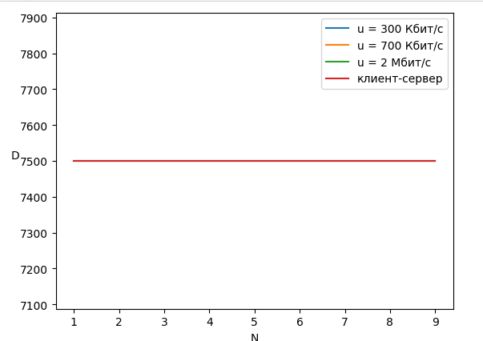

# Практика 5. Прикладной уровень

Ин тотал: написал несколько писем себе, через smtp - это вообще раз плюнуть, главное, чтоб не банили, через  socket - чуть сложнее, нужно подгуглить какие коды, как посылать сообщения и не запутаться самому, что ты уже заслал, а что ещё ждут, но тоже достижимо. Чтоб отправить картинку - нужно ещё немного подгуглиться о том, как разделить сообщение на несколько частей и дальше тоже без особых трудностей

Потом попробовал запустить через питон башовую команду и отловить резульат - никаких сложностей, чистый скилл и умение писать. Отправить себе по сокету уже не представляет никакого труда

С udp не успел поразбираться, что как там делается. Мб потом доделаю

И выполнил задачки, посчитал, порисовал графики, подоказывал простые вещи

## Программирование сокетов.

### A. Почта и SMTP (7 баллов)

### 1. Почтовый клиент (2 балла)
Напишите программу для отправки электронной почты получателю, адрес
которого задается параметром. Адрес отправителя может быть постоянным. Программа
должна поддерживать два формата сообщений: **txt** и **html**. Используйте готовые
библиотеки для работы с почтой, т.е. в этом задании **не** предполагается общение с smtp
сервером через сокеты напрямую.

Приложите скриншоты полученных сообщений (для обоих форматов).

#### Демонстрация работы

Сделано, написано. Но как-то очень странно работает, я указываю одну почту - он шлёт на предыдущую (т.е я вначале имел код, куда поставил свою гугловскую почту, после заменил её на яндексовую - а он почему-то всё по прежнему шлёт в гугл)

(Ещё нашёл в интернете топик, что посылая так из рамблера в гугл - приходит отказ по причине спам - вот тогда-то изменил на яндекс - он разок туда прислал, а теперь отказывается. Мб после перезагрузки что-то изменится, но кто знает...)

UPD: оказывается, у меня была включена переадресация, зато теперь я знаю, что умею отправлять на яндекс почту (и да, я считаю обязательным поделиться полным ходом, как я добивался успеха)

### 2. SMTP-клиент (3 балла)
Разработайте простой почтовый клиент, который отправляет текстовые сообщения
электронной почты произвольному получателю. Программа должна соединиться с
почтовым сервером, используя протокол SMTP, и передать ему сообщение.
Не используйте встроенные методы для отправки почты, которые есть в большинстве
современных платформ. Вместо этого реализуйте свое решение на сокетах с передачей
сообщений почтовому серверу.

Сделайте скриншоты полученных сообщений.

#### Демонстрация работы

Погуглил, какие есть коды для взаимодействия с smtp, поотправлял их на сервер, попутно чекая, что получаю правильные коды - получилось отправить себе письмо (не хочу выключать перенаправление, поэтому будут картинки с гугл почты, хоть и отправляю на яндекс)

### 3. SMTP-клиент: бинарные данные (2 балла)
Модифицируйте ваш SMTP-клиент из предыдущего задания так, чтобы теперь он мог
отправлять письма с изображениями (бинарными данными).

Сделайте скриншот, подтверждающий получение почтового сообщения с картинкой.

#### Демонстрация работы
К сожалению, ловлю бан, до записал дамп данных (в dump.txt), если я правильно понял гайды - что-то такое должно работать

_Многие почтовые серверы используют ssl, что может вызвать трудности при работе с ними из
ваших приложений. Можете использовать для тестов smtp сервер СПбГУ: mail.spbu.ru, 25_

### Б. Удаленный запуск команд (3 балла)
Напишите программу для запуска команд (или приложений) на удаленном хосте с помощью TCP сокетов.

Например, вы можете с клиента дать команду серверу запустить приложение Калькулятор или
Paint (на стороне сервера). Или запустить консольное приложение/утилиту с указанными
параметрами. Однако запущенное приложение **должно** выводить какую-либо информацию на
консоль или передавать свой статус после запуска, который должен быть отправлен обратно
клиенту. Продемонстрируйте работу вашей программы, приложив скриншот.

Например, удаленно запускается команда `ping yandex.ru`. Результат этой команды (запущенной на
сервере) отправляется обратно клиенту.

#### Демонстрация работы

Взял, выполнил `ls` 

### В. Широковещательная рассылка через UDP (2 балла)
Реализуйте сервер (веб-службу) и клиента с использованием интерфейса Socket API, которая:
- работает по протоколу UDP
- каждую секунду рассылает широковещательно всем клиентам свое текущее время
- клиент службы выводит на консоль сообщаемое ему время

#### Демонстрация работы
todo

## Задачи

### Задача 1 (2 балла)
Рассмотрим короткую, $10$-метровую линию связи, по которой отправитель может передавать
данные со скоростью $150$ бит/с в обоих направлениях. Предположим, что пакеты, содержащие
данные, имеют размер $100000$ бит, а пакеты, содержащие только управляющую информацию
(например, флаг подтверждения или информацию рукопожатия) – $200$ бит. Предположим, что у
нас $10$ параллельных соединений, и каждому предоставлено $1/10$ полосы пропускания канала
связи. Также допустим, что используется протокол HTTP, и предположим, что каждый
загруженный объект имеет размер $100$ Кбит, и что исходный объект содержит $10$ ссылок на другие
объекты того же отправителя. Будем считать, что скорость распространения сигнала равна
скорости света ($300 \cdot 10^6$ м/с).
1. Вычислите общее время, необходимое для получения всех объектов при параллельных
непостоянных HTTP-соединениях
2. Вычислите общее время для постоянных HTTP-соединений. Ожидается ли существенное
преимущество по сравнению со случаем непостоянного соединения?

#### Решение

Заметим, что задача равносильна такой же, но если бы был 1 процесс и скорость была $15$ б/с

Общая время задержка будет как обычно складываться:
1) Время на передачу - это $\frac{L}{R}$, $R = 15$, а $L: \ L_1 = 10^5 * 11 + 5 * 200, L_2 = L_1 + 5 * 200 * 10$ (на установление соединения необходимо 4 файла по 200б, чтоб провести рукопожатие)
$\frac{L_1}{R} = 73400 = T_1$, $\frac{L_2}{R} = \frac{L_1}{R} + \frac{10000}{R} = T_1 + 666.(6)$

2) Задержка распространения $n$ раза по $r_1 = \frac{(5 + 1 + 10) * 10}{3 * 10^8} ~ 5.3e-7, r_2 = r_1 + \frac{5 * 10}{3 * 10^8} = r_1 +  1.6e-7$

3) Задержек связанных с коммутатором считаем нет
Тогда в первом случае мы имеем $~73400$ секунд, против $~74066$ в другом, т.е. ускорение будет $~1\%$, что немного, но имеет значение 

### Задача 2 (3 балла)
Рассмотрим раздачу файла размером $F = 15$ Гбит $N$ пирам. Сервер имеет скорость отдачи $u_s = 30$
Мбит/с, а каждый узел имеет скорость загрузки $d_i = 2$ Мбит/с и скорость отдачи $u$. Для $N = 10$, $100$
и $1000$ и для $u = 300$ Кбит/с, $700$ Кбит/с и $2$ Мбит/с подготовьте график минимального времени
раздачи для всех сочетаний $N$ и $u$ для вариантов клиент-серверной и одноранговой раздачи.

#### Решение

Время на раздачу $F$ бит $N$ клиентам при одноранговом подходе есть 

$$D_{P2P} \geqslant max(\frac{F}{u_s}, \frac{F}{d_{min}}, \frac{NF}{u_s + \sum u_i}) $$

И при клиент серверном подходе: 

$$D_{C-S} \geqslant max(\frac{NF}{u_s}, \frac{F}{d_min}) $$

Как видим, при $N ~ 10$, разница не ощутима, $N ~ 100$ - разница в разы, а при н $N ~ 10^3$ только клиент-серверный метод продолжает расти, в отличие от остальных

### Задача 3 (3 балла)
Рассмотрим клиент-серверную раздачу файла размером $F$ бит $N$ пирам, при которой сервер
способен отдавать одновременно данные множеству пиров – каждому с различной скоростью,
но общая скорость отдачи при этом не превышает значения $u_s$. Схема раздачи непрерывная.
1. Предположим, что $\dfrac{u_s}{N} \le d_{min}$.
   При какой схеме общее время раздачи будет составлять $\dfrac{N F}{u_s}$?
2. Предположим, что $\dfrac{u_s}{N} \ge d_{min}$. 
   При какой схеме общее время раздачи будет составлять  $\dfrac{F}{d_{min}}$?
3. Докажите, что минимальное время раздачи описывается формулой $\max\left(\dfrac{N F}{u_s}, \dfrac{F}{d_{min}}\right)$?

#### Решение

1) Выражение равно в точности сколько нужно выкачать делённое на скорость выгрузки сервера - значит когда сервер будет каждому поочереди рассылать данные (каждый будет успевать закачивать в себя эти данные)

2) Теперь узким горлышком стало получение каким-то из клиентов. Мы ограничены тем временем, которое ему необходимо эти данные получать - максимум, что мы можем сделать, это отправлять всем поровну - т.е. при раздаче от сервера сразу всем

3) Неравенства всегда в одну из сторон верно, а значит либо первая оценка достигается, либо вторая. Можно тоже самое записать в компактной форме через максимум:

$$ \max\left(\dfrac{N F}{u_s}, \dfrac{F}{d_{min}}\right) $$