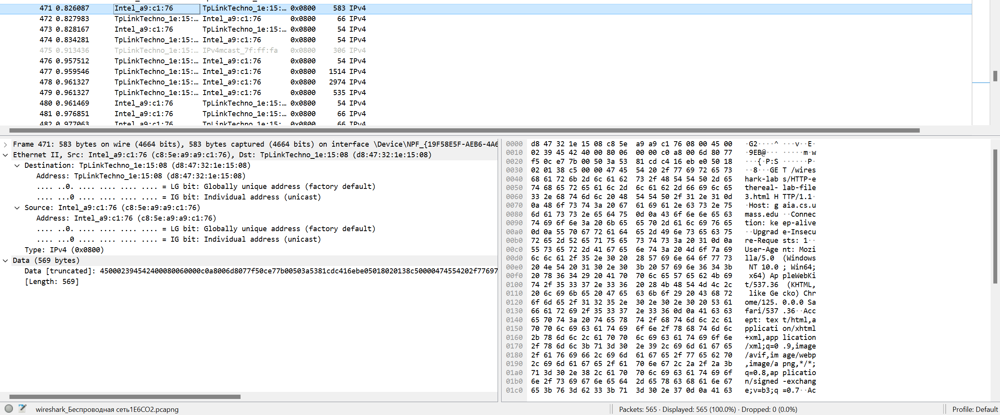
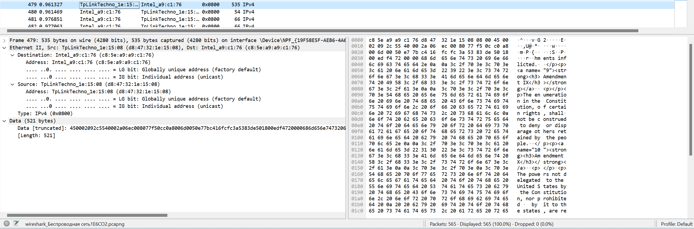
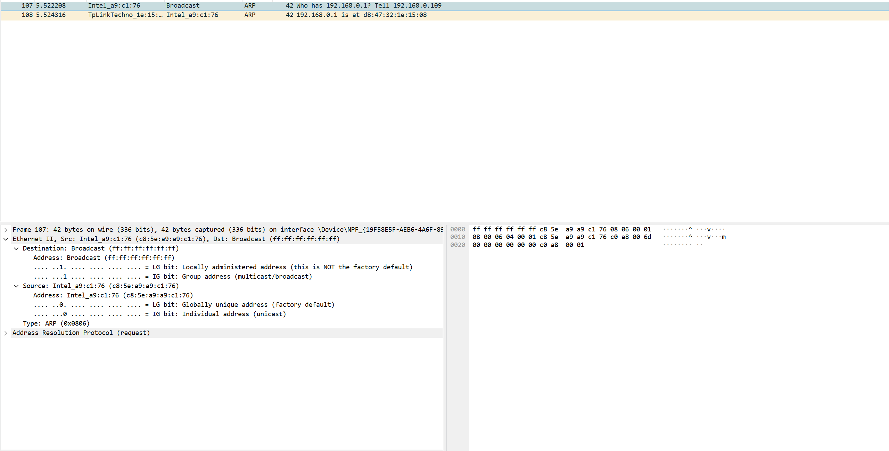
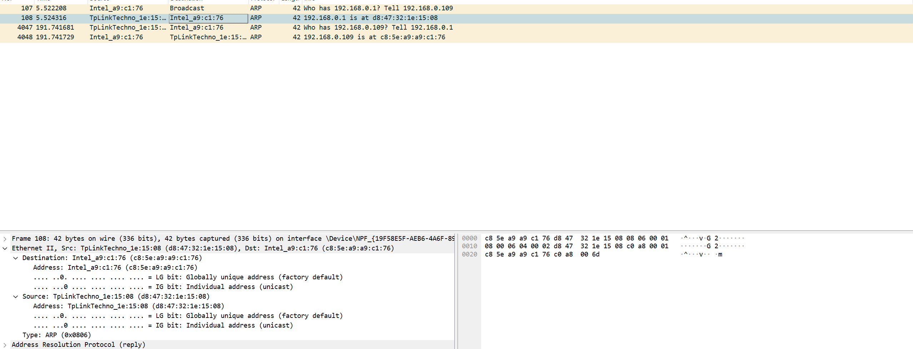

# Практика 14. Канальный уровень

## Wireshark: Ethernet и ARP (7 баллов)

### Захват и анализ Ethernet-кадров (3 балла)

#### Подготовка
1. Очистите кэш вашего браузера
2. Запустите анализатор пакетов Wireshark
3. Введите в адресную строку браузера следующий URL:
   http://gaia.cs.umass.edu/wireshark-labs/HTTP-ethereal-lab-file3.html
4. Остановите захват пакетов Wireshark
5. Найдите и запомните номер сообщения (крайний левый столбец), которое соответствует
   запросу HTTP GET, отправленному на адрес gaia.cs.umass.edu, а также номер сообщения,
   соответствующего началу ответного HTTP-сообщения, отправленного на ваш компьютер с 
   gaia.cs.umass.edu
6. Оставьте только пакеты, которые расположены ниже IP. Чтобы это сделать, выберите
   Analyze => Enabled Protocols и сбросьте флажок IP Protocol
7. Выберите кадр Ethernet, в котором содержится сообщение HTTP GET (на основе номера
   сообщения из п. 5). Раскройте раздел Ethernet II.

   

   
   
   Ethernet II, Src: Intel_a9:c1:76 (c8:5e:a9:a9:c1:76), Dst: TpLinkTechno_1e:15:08 (d8:47:32:1e:15:08)

#### Вопросы:
1. Каков 48-разрядный Ethernet-адрес вашего компьютера?
   c8:5e:a9:a9:c1:76

   (Intel_a9:c1:76)

2. Какому устройству соответствует значение Ethernet-адреса?
   Перейдите на сообщение, которое соответствует ответному HTTP-сообщению (отклику).
   
   Кажется, это мой сетевой адаптер

3. Каково значение исходного Ethernet-адреса? Какое устройство имеет такой Ethernet-адрес?

   d8:47:32:1e:15:08

   (TpLinkTechno_1e:15:08)
   
   Звучит, как первый роутер в сети

4. Каков адрес назначения в этом Ethernet-кадре? Это Ethernet-адрес вашего компьютера?

   c8:5e:a9:a9:c1:76  - да, моего 

### ARP-протокол (4 балла)

#### Подготовка:
1. Очистите ARP-кэш. Для этого запустите команду: `arp –d *`.
   Утилита arp находится для Windows C:\windows\system32, для Unix /sbin/arp или /usr/etc/arp
2. Повторите шаги 1-7 из предыдущего задания.
3. Найдите два ARP сообщения (запрос и ответ). У запроса в поле Destination должно быть Broadcast.

   

   

#### Вопросы:
1. Каковы шестнадцатеричные значения исходного и конечного адресов в Ethernet-кадре,
   содержащем сообщение с broadcast ARP-запросом?

   c8:5e:a9:a9:c1:76 и ff:ff:ff:ff:ff:ff

2. Содержится ли в ARP-сообщении IP-адрес отправителя?

   Содержится - 192.168.0.109

3. Где в ARP-запросе находится сама «вопросная часть» – Ethernet-адрес той машины, чей
   соответствующий IP-адрес мы запрашиваем?

   Target MAC address: 00:00:00_00:00:00 (00:00:00:00:00:00)
   Target IP address: 192.168.0.1


4. Где в сообщении с ARP-откликом хранится Ethernet-адрес, который мы запрашивали на
   основе соответствующего IP-адреса?

   Sender MAC address: TpLinkTechno_1e:15:08 (d8:47:32:1e:15:08)

## Программирование.

### Rest Service и токены доступа (10 баллов)
Продолжите работу с REST сервисом, созданным вами ранее в самом первом домашнем задании.

### A. Токен доступа (4 балла)
Поддержите возможность регистрации пользователя в вашем сервисе. При этом не используйте
уже готовые фреймворки и решения. Предложите свою «наивную» реализацию.

В этом задании достаточно все данные хранить в памяти, т.о. базу данных использовать НЕ
обязательно. Также вы можете при желании выгружать данные локально на диск (например,
сериализовать в файл).

Пользователь регистрируется, его данные сохраняются на стороне сервиса.

Новые операции, которые должен поддерживать сервис:
1. Зарегистрировать нового пользователя по адресу его почты и паролю 
   (email выступает в качестве логина пользователя).
   - `POST /user/sign-up`
   - Схема запроса:
     ```json
     {
         "email": "string",
         "password": "string"
     }
     ```
2. Авторизовать пользователя по логину и паролю. Сервис высылает обратно на сторону
   клиента токен доступа (можно использовать случайно сгенерированную строку)
   - `POST /user/sign-in`
   - Схема запроса:
     ```json
     {
         "email": "string",
         "password": "string"
     }
     ```
   - Схема ответа:
     ```json
     {
         "token": "string"
     }
     ```

Теперь во все операции с сервисом клиент может передавать полученный токен.
Если токен передан, то сервер понимает, кто это и разрешает доступ к расширенному функционалу.

1. Добавить новый продукт
   - `POST /product?token=<token>`
   - Если токен был передан, то созданный продукт будет ассоциирован с данным пользователем
   - Иначе продукт будет публичным
2. Получить/Обновить/Удалить продукт
   - `GET/PUT/DELETE /product/{product_id}?token=<token>`
   - Если токен был передан, то пользователь помимо публичных продуктов имеет доступ к своим собственным
   - Иначе пользователь имеет доступ **только** к публичным продуктам
3. Получить список всех продуктов
   - `GET /products?token=<token>`
   - Аналогично операции получения одного продукта — авторизованный
     пользователь получает расширенный список продуктов

Продемонстрируйте работоспособность вашего решения с помощью программы Postman:
запустите операции с токеном и без него и приложите скрин.

#### Демонстрация работы
todo

### Б. Приветственное сообщение (6 баллов)
Если пользователь использовал сервис без токена и посмотрел хотя бы один товар (по `product_id` или
список всех товаров), то ему на почту отправляется приветственный текст (например, "Рады видеть вас в
нашем сервисе вновь!").

Откуда сервису известен email пользователя? Сервис при регистрации пользователя запоминает
IP-адрес и привязывает его к учетке пользователя.

Будем считать, что, когда пользователь пользуется сервисом без регистрации (не предоставляет
токен доступа), но его IP-адрес есть среди списка зарегистрированных пользователей,
определяется email.

Приветственный email отправляется не сразу, а по истечении заданного времени (можно
использовать таймер). Каждый раз, когда пользователь вызывает какой-либо метод, таймер
сбрасывается.

Таким образом пользователь получит лишь один email после того, как закончит работать с сервисом:
пройдет определенное время и сработает таймер (один раз).

#### Демонстрация работы
todo

## Задачи

### Задача 1 (4 балла)
Вам предлагается вывести формулу эффективности протокола множественного доступа, схожего с
протоколом CSMA/CD. В этом протоколе время дискретное и все адаптеры работают синхронно.
Однако в отличие от дискретного варианта ALOHA длительность кванта времени много меньше
времени передачи одного кадра. Пусть длительность кванта равна $5$. Предположим, что все кадры
имеют постоянную длину $L = k \cdot R \cdot S$, где $R$ представляет собой скорость передачи данных в канале, а
$k$ – большое целое число. Пусть в сети $N$ узлов, у каждого из которых есть бесконечное количество
кадров для передачи. Также предполагается, что время распространения сигнала $d_{\text{распространения}} < S$,
так что все узлы могут обнаружить коллизию прежде, чем закончится очередной квант. Протокол
работает следующим образом:
- Если в течение данного кванта ни один из узлов не владеет каналом, все узлы состязаются
за канал, то есть в момент начала данного кванта каждый узел передает кадр с
вероятностью р. Если передачу начинает ровно один узел, этот узел захватывает канал на
последующие $k - 1$ квантов и передает кадр целиком.
- Если какой-либо узел владеет каналом, все остальные узлы воздерживаются от передачи
до тех пор, пока данный узел не закончит передачу кадра. Как только узел заканчивает
передачу кадра, все узлы начинают борьбу за канал.

Обратите внимание, что канал попеременно находится в одном из двух состояний: в
«продуктивном состоянии», длящемся ровно $k$ квантов, и в «непродуктивном состоянии»,
длительность которого случайна. Очевидно, что коэффициент использования канала равен
$\frac{k}{k + x}$, где $x$ – ожидаемое количество последовательных непродуктивных квантов.
1. Определите эффективность этого протокола для фиксированных значений $N$ и $p$.
2. Для фиксированного значения $N$ определите значение $p$, при котором эффективность является
максимальной.
3. Используя значение $p$ (являющееся функцией $N$), полученное в предыдущем упражнении,
определите эффективность при значении $N$, стремящемся к бесконечности.
4. Покажите, что эффективность приближается к $1$ при увеличении размера пакета.

#### Решение

1. Вероятность захвата канала: $N p (1 - p) ^ {N - 1}$. Мат.ожидание подбрасываний монетки до выпадения необходимой орла (чья вероятность $q$): $\frac{1}{q}$, колчиество неудач на одну меньше. Тогда $x = \frac{1}{Np(1 - p) ^ {N - 1}} - 1$

Итого:

$$ \frac{k}{k -1 + \frac{1}{Np(1 - p) ^ {N - 1}} } $$

2. Будем смотреть на логарифм. Найдём нули производной , там локальные экстремумы, он будет один - там будет локальный максимум, причём больший, чем в концах:


$$ \left[ \log \frac{k}{k -1 + \frac{1}{Np(1 - p) ^ {N - 1}} }\right]' =  -\log\left[k -1 + \frac{1}{Np(1 - p) ^ {N - 1}} \right]'$$
$$ -\frac{1}{k - 1 + \frac{1}{Np(1 - p) ^ {N - 1}}} \cdot \frac{-1}{Np(1 - p) ^ {N - 1}}^2 \cdot (N(1 - p)^{N - 2} (1 - p - p(N - 1)))$$

Тогда необходимо, чтоб $1 = pN$, т.е. максимум при $p = \frac{1}{N}$

3. При устремлении $Np(1 - p) ^ {N - 1} \rightarrow \frac{1}{e}$. Тогда в итоге будет стремиться к $\frac{k}{k - 1 + e}$

4. По $k$ около бесконечности это $1$ т.к. $= 1 - \fraac{e - 1}{k + e - 1}$ - недостаток мал при достаточно большом $k$

### Задача 2 (4 балла)
Исследуем применение небольших пакетов в приложениях для IP-телефонии. Один из
недостатков, связанных с небольшим размером пакетов, заключается в следующем: значительная
часть полосы передачи данных в канале тратится на пересылку лишних байт. Поэтому
предположим, что пакет состоит из $P$ байт плюс $5$ байт заголовка.
1. Рассмотрим непосредственную отправку исходного голосового материала в цифровой форме.
Предположим, что звук закодирован с постоянным битрейтом $128$ кбит/с. Также будем исходить
из того, то каждый пакет заполняется целиком, и лишь после этого источник отсылает пакет в сеть.
Время, требуемое на наполнение пакета, называется **задержкой пакетирования**. В контексте $L$
определите задержку пакетирования в миллисекундах.
2. Задержка пакетирования, превышающая $20$ мс, может провоцировать заметное и неприятное
эфирное эхо. Определите задержку пакетизации для $L = 1500$ байт (что примерно соответствует
максимальному размеру Ethernet-пакета) и для $L = 50$ (примерно соответствует размеру ATM-пакета).
3. Вычислите задержку, возникающую при продвижении пакетов с промежуточным хранением
для одного коммутатора при скорости передачи в канале $R = 622$ Мбит/с, для значений $L = 1500$
байт и $50$ байт.
4. Опишите преимущества, связанные с использованием пакетов небольшого размера. 

#### Решение

1. Если я правильно понял, предлагается $P = L$. Тогда задержка пакетирования $\frac{L + 5\text{байт}}{128 \text{кбит/с}} = \frac{L + 5}{128 \cdot 125} = \frac{L + 5}{16} \text{ms}$

2. Для $L = 1500: \frac{1505}{8} \text{ms} = 94.0625 \text{ms} > 20$

Для $L = 50: \frac{50}{8} \text{ms} = 3.125 \text{ms} < 20$

